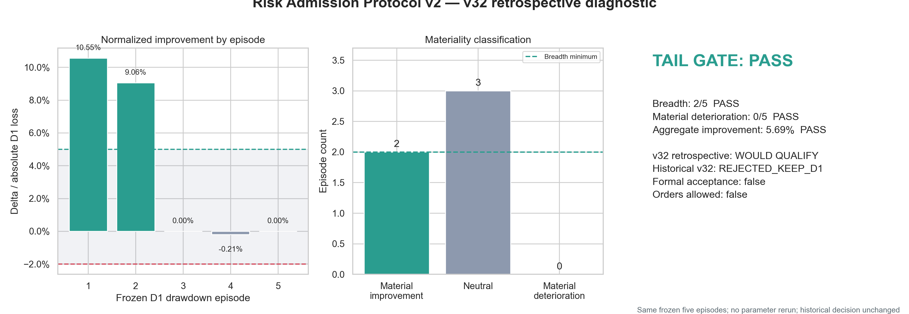

# Risk Admission Protocol v2

The former strict `3/5 fixed drawdowns improve` heuristic is retired for future candidates. It is
replaced by a materiality-aware Tail-Episode Robustness Gate:

- at least two episodes must improve by at least 5% relative to their D1 loss;
- no episode may deteriorate by 2% or more relative to its D1 loss;
- the five fixed episodes must improve in aggregate.

The complete frozen specification is in
[`docs/RISK_ADMISSION_PROTOCOL_V2.md`](docs/RISK_ADMISSION_PROTOCOL_V2.md).

## v32 retrospective diagnostic

**V32_WOULD_QUALIFY_UNDER_PROTOCOL_V2_RETROSPECTIVE_ONLY**

| Episode | Normalized improvement | Classification |
|---:|---:|---|
| 1 | 10.55% | Material improvement |
| 2 | 9.06% | Material improvement |
| 3 | 0.00% | Neutral |
| 4 | -0.21% | Neutral |
| 5 | 0.00% | Neutral |

The tail gate passes with 2 material improvements, 3 neutral episodes, no material deterioration
and +5.69% aggregate fixed-tail improvement. Every unchanged v32 admission check also passes.

This result is retrospective only. The historical v32 status remains **`V32_REJECTED_KEEP_D1`**;
formal acceptance is false, D1 remains selected, risk admission is false and orders remain
disabled. The next candidate specified and frozen after Protocol v2 may use the new gate
prospectively.

Detailed outputs are in
[`reports/risk_admission_protocol_v2/`](reports/risk_admission_protocol_v2/).
