# v29.4 D1 versus v31 — Required Result Figures

These figures compare the frozen v29.4 D1 strategy with every pre-registered v31 position-level
loss-stop candidate. All charts use only the frozen 2008-01-02 to 2016-12-30 train period.

## Executive view

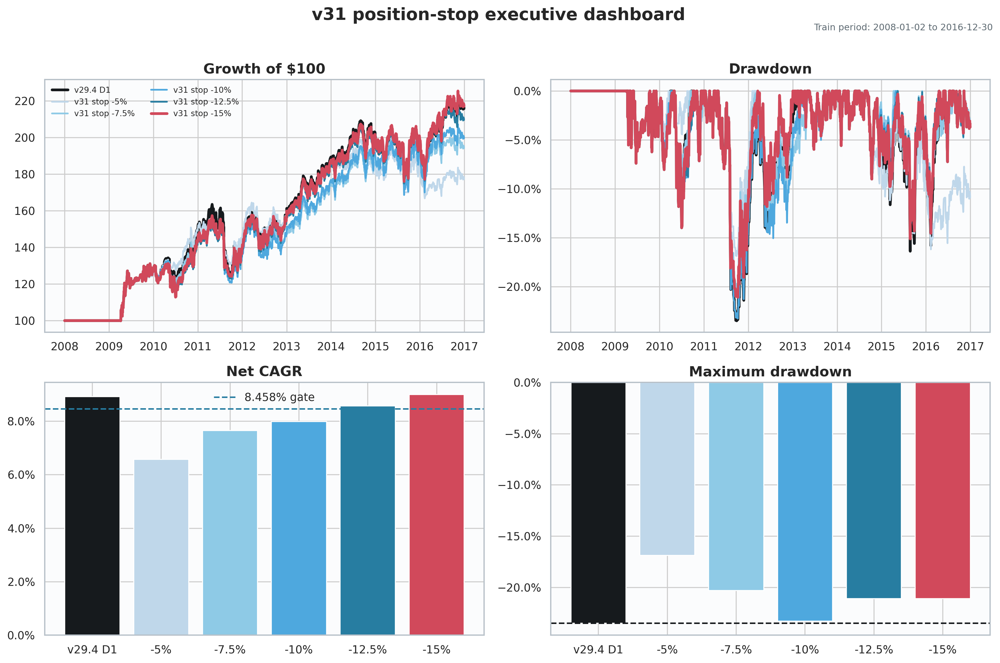

## Return path

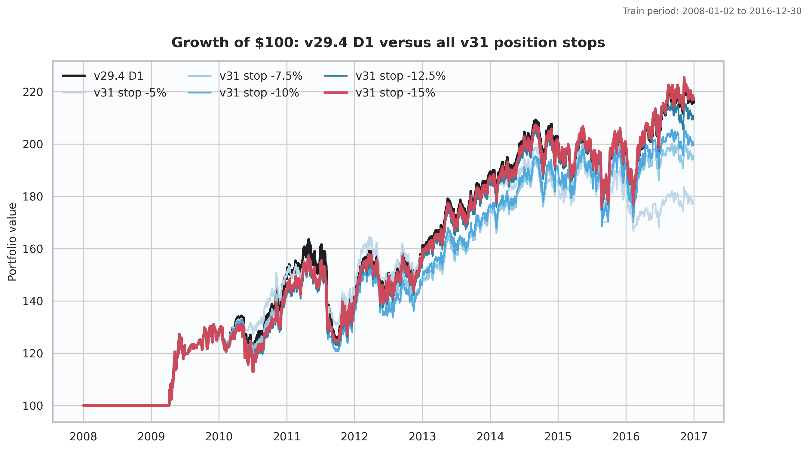

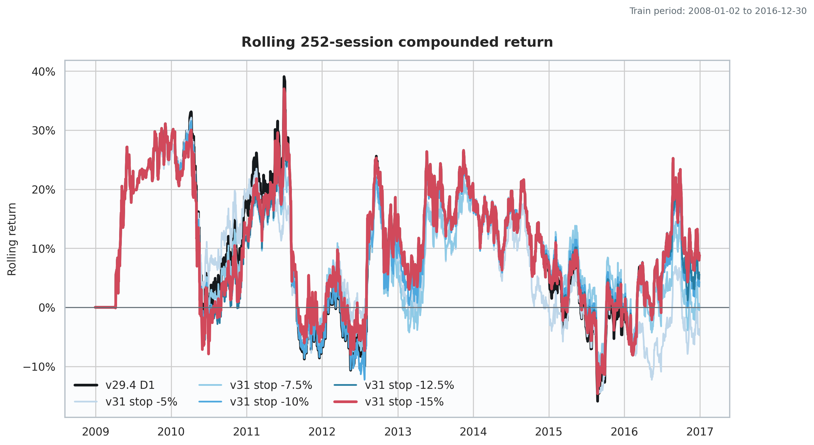

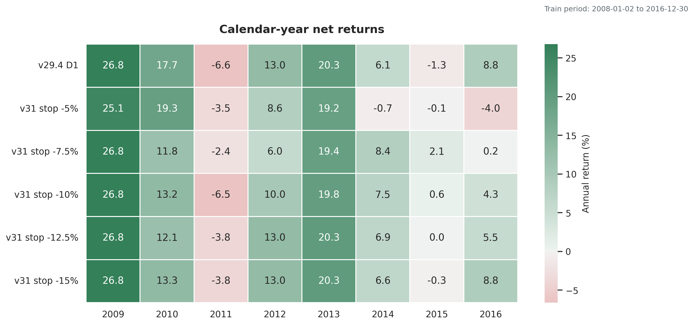

## Tail risk

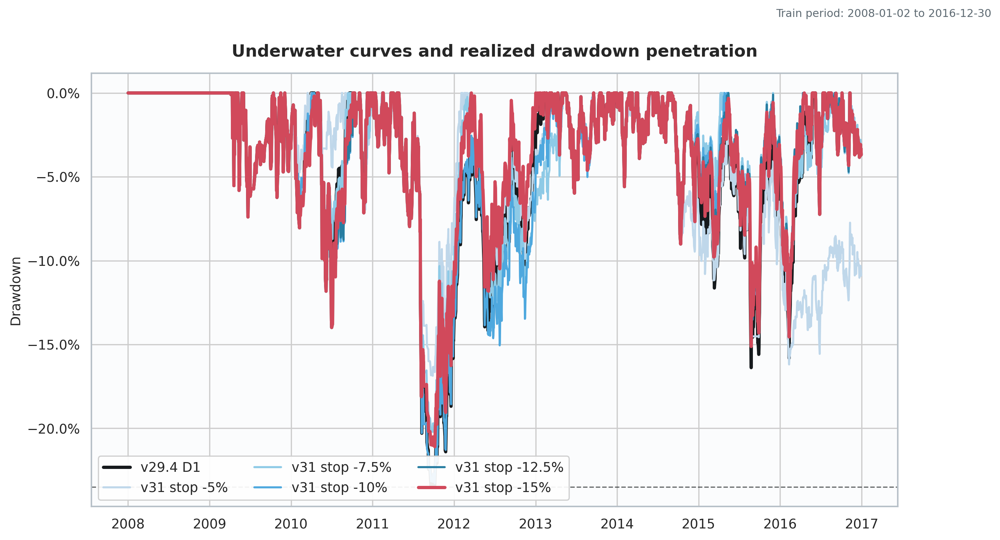

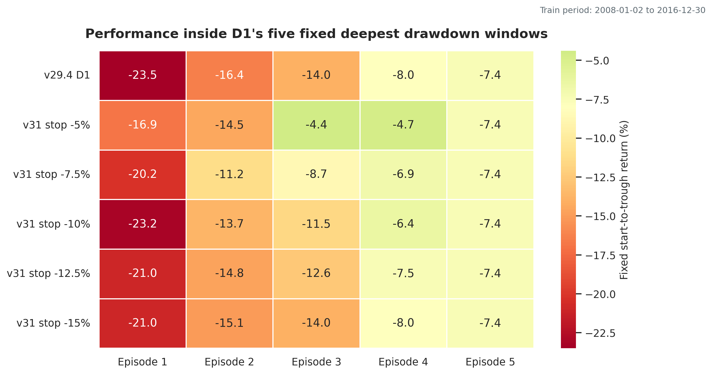

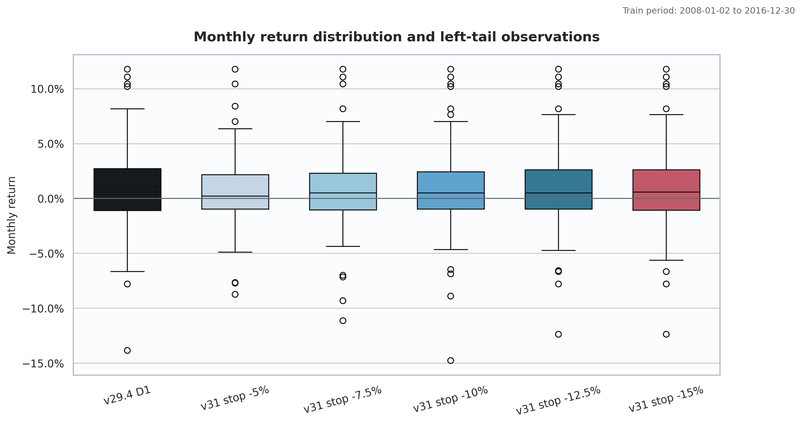

## Exposure and admission

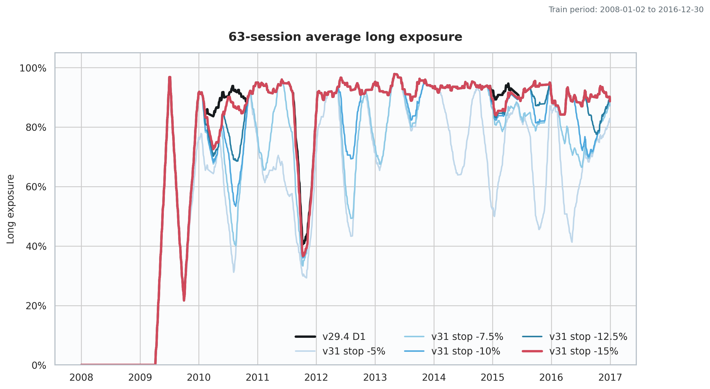

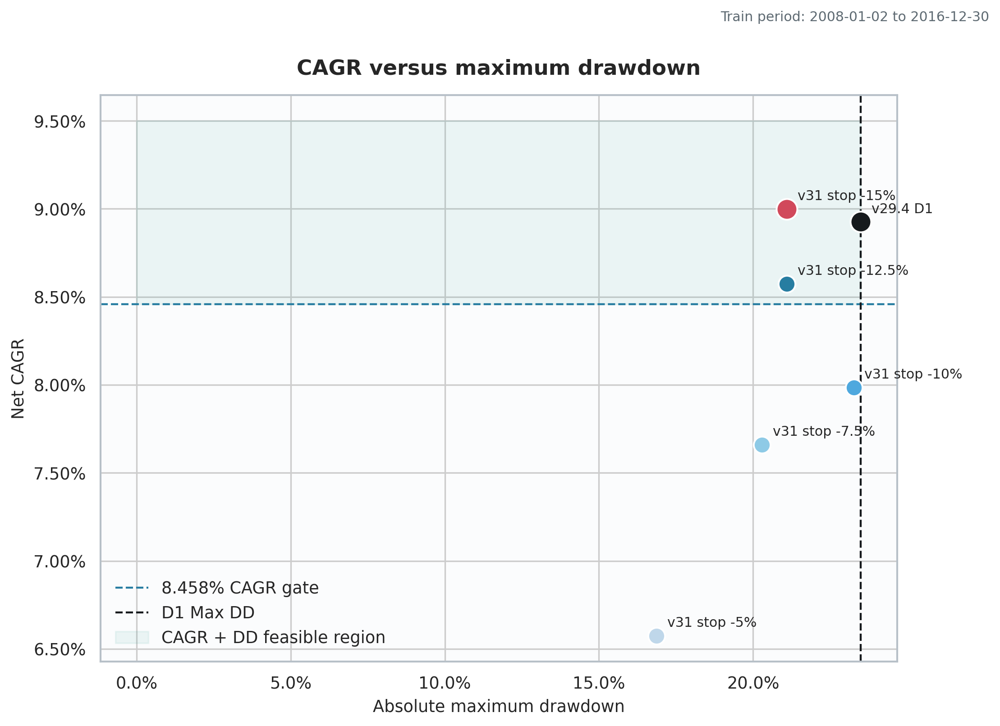

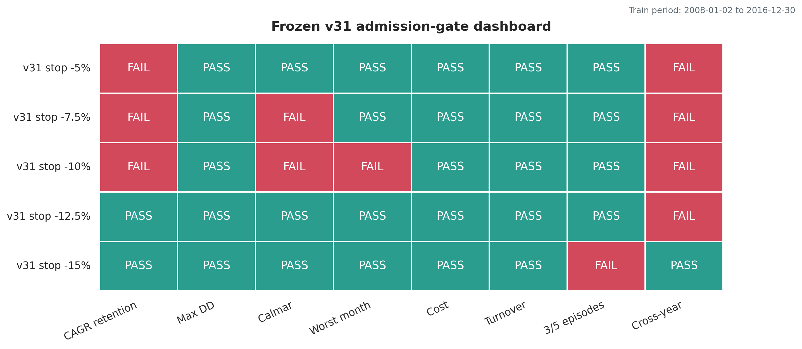

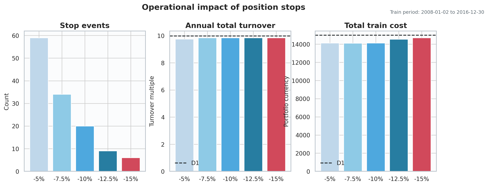

The combined print-ready file is
[`v29_4_D1_vs_v31_all_figures.pdf`](reports/d1_position_loss_stop_v31/figures/v29_4_D1_vs_v31_all_figures.pdf).
